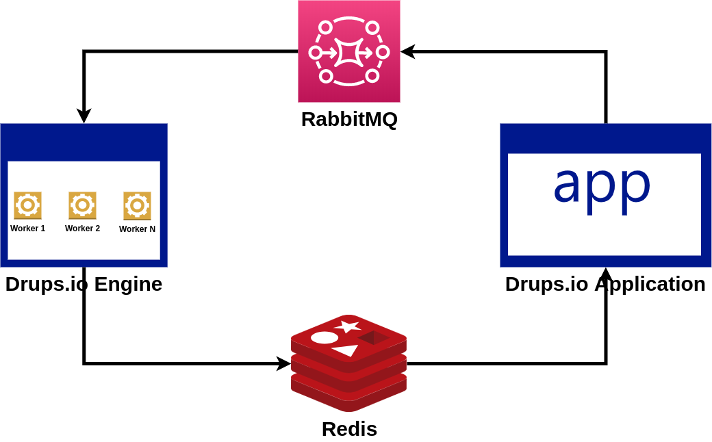

# What is Drups.io Engine

Drups.io Engine is a bridge between [Drups.io Application](https://drupsio.readthedocs.io/projects/application) and
DevOps stuff. It takes care about Cloning, Building and Deploying the user projects.

The connection between Engine and Application is implemented by using the
[Message Broker pattern](https://en.wikipedia.org/wiki/Message_broker). We use [RabbitMQ](https://www.rabbitmq.com/)
as our broker and [Redis](https://redis.io/) as the Celery Result Backend. [Celery](https://docs.celeryproject.org)
is our Task Queue provider.

**Connection between Drups.io Engine and application**

